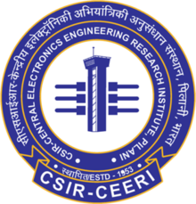
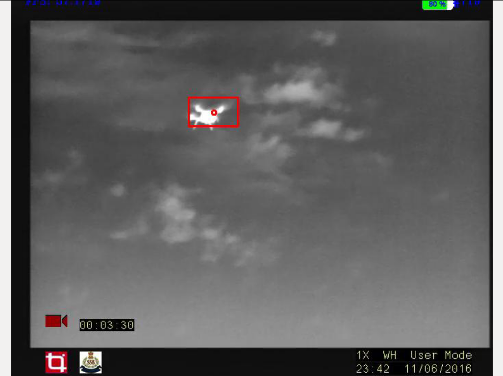
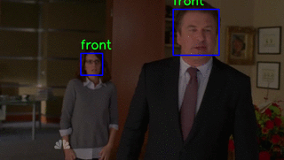

Hello!
I am a Masters in Computer Science graduate from Georgia Institute of Technology, with a specialization in Machine Learning. I have enjoyed working on a range of [projects](#projects) in Natural Language Processing, Computer Vision and Robotics in both industrial and academic setups.

I completed my Bachelor's degree in Computer Science from BITS Pilani where I took up courses and projects related to Pattern Recognition, Machine Learning and Computer Graphics. Through my interships and work, I have had the opportunity to implement projects in these fields. 

More details about my [publications](#publications), [projects](#projects) and [experience](#experience) below.

## Publications
__PBP: Path-based Trajectory Prediction for Autonomous Driving__ [[arxiv](https://arxiv.org/abs/2309.03750)]\
Sepideh Afshar, Akshay Bhagat, Nachiket Deo, Titas Chakraborty, Balarama Raju Buddharaju, **Adwait Deshpande**, Henggang Cui\
Accepted to *ICRA 2022*

__Indic-Transformers: An Analysis of Transformer Language Models for Indian Languages__ [[arxiv](https://arxiv.org/abs/2011.02323)]\
Kushal Jain \*, **Adwait Deshpande** \*, Kumar Shridhar, Felix Laumann, and Ayushman Dash\
Accepted to *ML-RSA workshop, NeurIPS 2020*

__NERDSearch : Using Familiar Gameplay Mechanics for Linguistic Annotation__ [[pdf](https://wordplay-workshop.github.io/wordplay2020/pdfs/15.pdf)]\
**Adwait Deshpande** and Nischay Ghattamraju\
Accepted to *Wordplay, NeurIPS 2020*

## Experience
{:width="50" style="padding:5px"} **GeorgiaTech, Atlanta, GA**  
_Research Scientist II, AI-CARING_ (Aug 2023 - Present)  
Developing state-of-the-art activity recognition for smart homes to assist the elderly in daily living  
[Link](https://www.ai-caring.org/)

{:width="50" style="padding:5px"} **Motional, Pittsburgh, PA**  
_Machine Learning Intern, Prediction_ (May 2022 - Aug 2022)  
R&D for lane-aware and map complian motion prediction models based on Transformers

{:width="50" style="padding:5px"} **Reverie Language Technologies Pvt. Ltd., Bengaluru**  
*Technical Lead, R&D* (July 2019 - July 2021)  
NLP for low corpus Indian Languages to solve problems in digital accesibility

{:width="50" style="padding:5px"} **Endless Robotics Pvt. Ltd., Hyderabad**   
*Computer Vision Engineer / Software Architect* (Aug 2016 – Apr 2019)   
Responsible for desigining the software architecture for a one-of-a-kind wall painting robot   
Researched and developed 3D mapping, image rectification, pattern recognition to help the robot navigate
in sparsely featured environments

{:width="50" style="padding:5px"} **Tonbo Imaging Pvt. Ltd., Bengaluru**   
*Member of Technical Staff, R&D* (July 2015 – July 2016)  
Real-time Multi-object detection and tracking for visible and IR video streams

{:width="50" style="padding:5px"} **Tonbo Imaging Pvt. Ltd. Bengaluru**  
*Intern* (July 2014 - Dec 2014)   
Developed application to improve accuracy and cut down time required for camera calibration  
Worked on OpenSceneGraph for rendering configurable, realistic video scenes for data generation  

{:width="50" style="padding:5px"} **Central Electronics Engineering Research Institute, Pilani**  
*Project Assistant, Study Oriented Project* (Jan 2014 - Apr2014)  
Worked on head detection in different poses using cascaded classifiers

## Projects
{:width="150" style="padding:10px"}
**Unsupervised clustering for sign languages** [more](https://github.com/aoxolotl/slr)  

{:width="150" style="padding:10px"} **3D map for sparsely featured environments**  
Project at Endless Robotics    
[code](https://github.com/aoxolotl/slam)  
  
{:width="150" style="padding:10px"}
**Multi object detection and tracking**  
Project at Tonbo Imaging Pvt. Ltd.  
[video](https://www.youtube.com/watch?list=PLSstQfZmdaXExyIMN6VM_w0KRleB8weVS&v=Ih7xU9-zGDE)
  
{:width="150" style="padding:10px"}
**Head detection using cascaded classifiers**  
Project at CEERI   
[code](https://github.com/aoxolotl/head-detector)  

**Image rectification using AprilTags**  
Project at Endless Robotics  
[code](https://github.com/aoxolotl/apriltag_warp)

