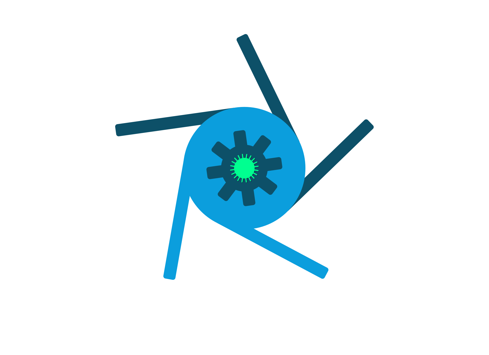
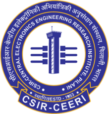
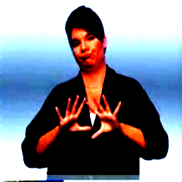
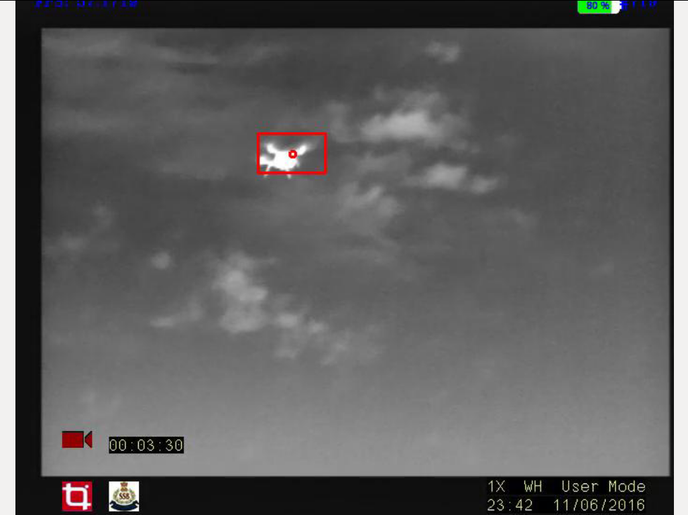
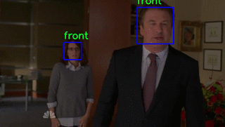

I am currently a Technical Lead, R&D at *Reverie Language Technologies*, that is letting me explore all that I love about languages and linguistics. I have previously enjoyed working on a range of projects in Computer Vision and Robotics in both industrial and academic setups. 

I completed my Bachelor's degree in Computer Science from BITS Pilani where I took up courses and projects related to Pattern Recognition, Machine Learning and Computer Graphics. Through my interships and work, I have had the opportunity to implement projects in these fields. Details about my [projects](#projects) and [experience](#experience) below.

## Experience

{:width="50" style="padding:5px"} **Reverie Language Technologies Pvt. Ltd., Bengaluru**  
*Senior Software Developer, R&D* (July 2019 -)  
Working on NLP for low corpus Indian Languages to solve problems in digital accesibility.  

{:width="50" style="padding:5px"} **Endless Robotics Pvt. Ltd., Hyderabad**   
*Computer Vision Engineer / Software Architect* (Aug 2016 – Apr 2019)   
Responsible for desigining the software architecture for a one of a kind wall painting robot.   
Also worked on a 3D mapping, image rectification, pattern recognition to help the robot navigate
in sparsely featured environments.  

{:width="50" style="padding:5px"} **Tonbo Imaging Pvt. Ltd., Bengaluru**   
*Member of Technical Staff* (July 2015 – July 2016)  
Real-time Multi-object detection and tracking for visible and IR video streams.

{:width="50" style="padding:5px"} **Tonbo Imaging Pvt. Ltd. Bengaluru**  
*Intern* (July 2014 - Dec 2014)   
Worked on OpenSceneGraph for rendering configurable, realistic video scenes for data generation.  
Developed application to improve accuracy and cut down time required for camera calibration

{:width="50" style="padding:5px"} **Central Electronics Engineering Research Institute, Pilani**  
*Project Assistant, Study Oriented Project* (Jan 2014 - Apr2014)  
Worked on head detection in different poses using cascaded classifiers.
## Publications
Jain, Kushal, **Adwait Deshpande**, Kumar Shridhar, Felix Laumann, and Ayushman Dash. *"Indic-Transformers: An Analysis of Transformer Language Models for Indian Languages."* Accepted to ML-RSA workshop, NeurIPS 2020 [PDF](https://arxiv.org/pdf/2011.02323). 

**Deshpande, Adwait** and Ghattamraju, Nischay. *"NERDSearch : Using Familiar Gameplay Mechanicsfor Linguistic Annotation."* Accepted to Wordplay, NeurIPS 2020 [PDF](https://wordplay-workshop.github.io/modern/assets/pdfs/15.pdf)

## Projects
{:width="200" style="padding:10px"}
**Unsupervised clustering for sign languages**    
[more]({{ site.github_url }}/sl_cluster)  

{:width="200" style="padding:10px"} **3D map for sparsely featured environments**  
Project at Endless Robotics    
[code]({{ site.github_url }}/slam)  
  
**Image rectification using AprilTags**  
Project at Endless Robotics  
[code]({{ site.github_url }}/apriltag_warp)  

{:width="200" style="padding:10px"}
**Multi object detection and tracking**  
Project at Tonbo Imaging Pvt. Ltd.  
[video](https://www.youtube.com/watch?list=PLSstQfZmdaXExyIMN6VM_w0KRleB8weVS&v=Ih7xU9-zGDE)
  
{:width="200" style="padding:10px"}
**Head detection using cascaded classifiers**  
Project at CEERI   
[code]({{ site.github_url }}/head-detector)  
  
